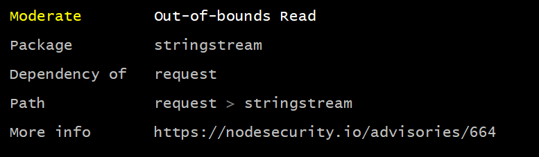
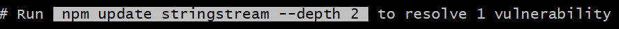

# Node.js Secure Development [Language Best Practices]
<font size="-1">_Author: Brandon Caldwell - Dec. 2018_</font>

### Overview


This guide will provide general best practices for developing more secure code in Node.js.
- [Always Validate External Inputs](#always-validate-external-inputs)
- [HTTP Headers](#http-headers)
- [Use of eval()](#use-of-eval)
- [Always Use HTTPS (>TLS1.0)](#always-use-https-tls10)
- [Localhost isn’t inherently safe from the web](#localhost-isnt-inherently-safe-from-the-web)
- [NPM Package Tools and Risks](#npm-package-tools-and-risks)


### Recommendations
#### Always Validate External Inputs
###### Why We Care

Generally the most dangerous part of any software is the point where it will process untrusted external data. As such, it is one of the most important areas to ensure attention is given.
###### Example of Issue
```javascript
    function buildList (var untrustedListSize){
        if ( 0 > untrustedListSize ){
            new Error("Negative value supplied for list size, die evil hacker!");
        }

        var list = new Widget [ untrustedListSize ];
        list[0] = new Widget();
    }
```
<sub>_(Adapted from: https://cwe.mitre.org/data/definitions/20.html)_</sub>

###### How to Fix?

There are several validation libraries. The AppSec team hasn’t investigated and compared validation packages out there, though express-validator.js seems like a popular option among the Node.js community.

Mozilla has a decent article covering some basic of using that package: https://developer.mozilla.org/en-US/docs/Learn/Server-side/Express_Nodejs/forms  
###### Risk Rating

While lack of validation can present a significant risk, it requires the underlying area of code to be vulnerable to exploitation, as such, this is considered a Low severity issue.

Though if the underlying code is vulnerable, this will lead to High sev vulnerabilities.
###### References

MITRE Guidance - https://cwe.mitre.org/data/definitions/20.html  

OWASP Guidance - https://www.owasp.org/index.php/Data_Validation  

---
### HTTP Headers
###### Why We Care

HTTP headers can allow a page developer to inform the browser to apply various protections against web attacks, such as Clickjacking and XSS.

###### Examples of Issue

- X-Frame-Options - Protect from clickjacking
- Strict-Transport-Security - Enforce HTTPS and protect against downgrade attacks
- X-XSS-Protection - Enable XSS protections in browsers that support this header
- Content-Security-Policy - Can restrict code script comes from and can be executed
###### How to Fix?

Manually review and employ headers as appropriate for your HTTP connections. OWASP has nice list of relevant headers as part of their Secure Headers Project .


Further, the Helmet package (available via npm as well) is a frequently recommended library to help provide these protection.
###### Risk Rating

Low-High
###### References

- https://www.owasp.org/index.php/OWASP_Secure_Headers_Project#tab=Main  
- Helmet - https://www.npmjs.com/package/helmet  

---
### Use of eval()
###### Why We Care

Use of the eval() function is incredibly dangerous, and rarely actually needed. The function allows an attacker to simply and directly execute code on the target site.
###### Example of Issue

eval(< anything in here> ) :D
###### How to Fix?

Generally, it's completely unsafe to execute untrusted code, and as such, should be avoid entirely. Any case of such use to be considered very seriously.

If running untrusted script determined to be requisite, work with the product security team to determined the best method to isolate this code. In some cases, using the native VM module, which exposes Node.js' V8 engine is acceptable, in other cases, more robust isolation may be required.
###### Risk Rating

Low - High
###### References

- https://developer.mozilla.org/en-US/docs/Archive/Add-ons/Overlay_Extensions/XUL_School/Appendix_C:_Avoid_using_eval_in_Add-ons   (Talks about use in add-ons, but applies elsewhere as well)
- Node.js VM - https://nodejs.org/api/vm.html

---
### Always Use HTTPS (>TLS1.0)
###### Why We Care

HTTP traffic is unencrypted, meaning that any traffic that goes across untrusted/uncontrolled channels is completely untrustworthy. Further, on modern computers, the perf hit for HTTPS with effectively negligible given the increase in trust gained from an encrypted channel.
###### How to Fix?

Always enable TLS :)

Node’s native TLS library - https://nodejs.org/api/tls.html

Nginx TLS - https://wiki.mozilla.org/Security/Server_Side_TLS#Recommended_Server_Configurations  
###### Risk Rating

Med
References

- https://www.eff.org/https-everywhere
- https://www.maxcdn.com/blog/ssl-performance-myth/  

---
### Localhost isn’t inherently safe from the web
###### Why We Care

We’ve found that many teams have engineered interfaces hosting local client REST services mistakenly believing that binding to localhost proved protection from remote attackers. However, localhost can be reached from a web browser, leaving these services vulnerable to attack from malicious web pages.
###### Example of Issue

See CVE-2017-12939 @ https://unity3d.com/security#CVE-2017-12939

This vulnerability was a remote code execution vulnerability found in the Unity Editor wherein, if a malicious website was opened by a user, the attacker could run arbitrary code on the victim’s machine, via a REST service bound to localhost , running in the Editor.
###### How to Fix?

Enable CORS in your project. Here’s an example value:

Access-Control-Allow-Origin: https://localhost:<port>
###### Risk Rating

Medium


###### References

- Express has a popular CORS library: https://github.com/expressjs/cors  

---
### NPM Package Tools and Risks
#### npm audit

Not a risk in itself, but the audit option of npm is a recently added feature to automatically scan installed packages for you project, with severity ratings and links to the details on the scanned risks. It’s recommended that this is run regularly against all projects, to help identify vulnerabilities that may exist in dependencies.
###### Why We Care

Unpatched npm packages can easily be exploited as the vulnerabilities are made public once patched.
###### Example of Issue

Here’s an example output:


###### How to Fix?

The audit option already provides simple ‘auto-fix’ functionality, and will help you out, such as:


Further, npmjs released the npm audit fix option that should automatically address as many vulnerabilities as possible.
###### Risk Rating

The tool will provide the risk rating for each vulnerability found.

###### References
- [npm audit](https://blog.npmjs.org/post/173719309445/npm-audit-identify-and-fix-insecure)
- [npm audit fix](https://blog.npmjs.org/post/174001864165/v610-next0)

---
### Outdated Packages
As with all 3rd party source code, be sure to use the latest available version of the package.
###### Why We Care

Vulnerabilities in packages are identified every day, and are usually as easy to fix as just updating the package.
###### Example of Issue

Express, a widely used HTTP package,  published their vulnerabilities here: https://expressjs.com/en/advanced/security-updates.html  
###### How to Fix?

Use npm update,  or leverage the npm audit command described in this document.
###### Risk Rating

The Risk Rating of the vulnerability is identified by the vendor reporting the issue.


### Additional Reading
- Fun read with real world Node.js security issues: https://www.owasp.org/images/f/fa/AppSecIL2016_NodeJS-Security_LiranTal.pdf
- Security recommendations from the Express team: https://expressjs.com/en/advanced/best-practice-security.html  
- OWASP’s Node Goat Project: https://github.com/OWASP/NodeGoat  

